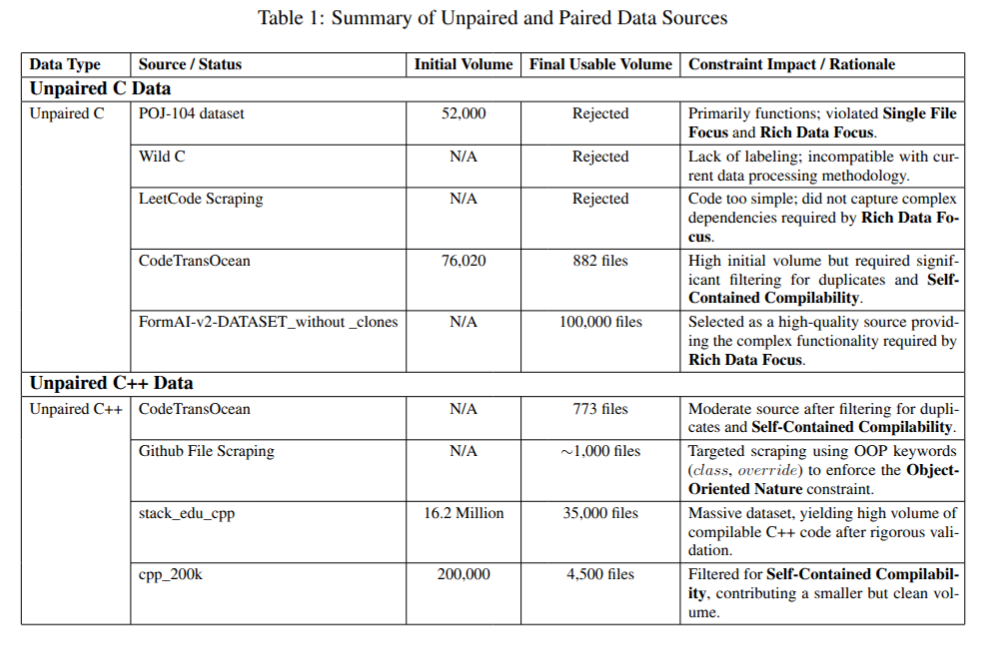

# Ditto

<p align="center">
  
  <br>
  <small><i>Image source: https://tenor.com/search/ditto-pokemon-gifs</i></small>
</p>

## Table of Contents

- [Ditto](#Ditto)
  - [Table of Contents](#table-of-contents)
  - [Introduction](#introduction)
  - [Methodology](#methodology)
      - [Data Collection](#data-collection)
      - [Preprocessing](#preprocessing)
      - [Model Architecture](#model-architecture)
      - [Evaluation](#evaluation)
  - [File Structure](#file-structure)
  - [Getting started](#Getting-Started)
      - [Data](#data)
      - [Pretrained Models](#pretrained-models)
  - [Future Goals](#future-goals)
  - [References](#references)
  - [License](#license)

## Introduction

Ditto is a transpiler that converts code between C++ and C languages. The name comes from the Pokémon Ditto, which can copy any other Pokémon exactly. Our goal is to build an AI transpiler that can translate code across different programming paradigms, no matter the language. For our project, we focus on C++ to C conversion and vice versa. Through this project, we aim to explore 2 hypotheses:

1) Can we build an AI system that is able to transpile code across programming paradigms? (For example, C → C++)

2) Can we integrate compiler domain knowledge to improve the performance of deep learning models?

## Methodology

The methodology comprises of 4 major sections: Data Collection, Preprocessing, Model Architecture and Evaluation.

### Data Collection

The below table enlists some major sources of data that we used to create our dataset.

<p align="center">
  
</p>

This spreadsheet contains the list of GitHub repositories we used to obtain data: https://docs.google.com/spreadsheets/d/1GKgE6r3UVirJbOs1KG2cyKQyNwJphTpj2JwjQkrZtrs/edit?gid=0#gid=0 

After aggregating data from all sources, we have ~1.2L C code snippets and ~65K C++ code snippets. These are available in `data` section of README as Raw Data.

For more details on Data Collection section along with examples, please refer `data-collection/README.md`. 

### Preprocessing

This section deals with conversion of code in raw form to tokens. 

For eg,

```c
#include <stdio.h>

void greet()
{
  printf("%s", "Ditto!");
}

int main()
{
  int x = 5;
  int y = 10;
  int z = x + y;

  return 0;
}
```

This should become

`
[
"#include", "<stdio.h>", "void", "func0", "(", ")", "{", "printf", "(", "lit0", ",", "lit1", ")", ";", "}", "int", "main", "(", ")", "{", "int", "var0", "=", "lit2", ";", "int", "var1", "=", "lit3", ";", "int", "var2", "=", "var1", "+", "var0", ";", "return", "lit3", ";", "}"
]
`

In addition to these tokens, we should recieve the mappings for obfuscated variables, functions, classes, structs, literals, etc. 

For more details on preprocessing section along with examples, please refer `preprocessing/README.md`. 

### Model Architecture

The model architecture is inspired from Transcoder and Translatotron 3. We use a shared encoder for both C and C++, and separate decoders for both languages.

The model is divided into two phases. The aim of first phase it to learn the shared encoder, and both decoders. The second phase of the model involves learning mapping between C and C++ using back translation.

We use both phases to ensure that our model can learn converting C++ to C and vice versa without using any paired data. The below diagrams represent the model phases.

<p align="center">
  
  <br>
  <small><i>Phase 1</i></small>
</p>

<p align="center">
  
  <br>
  <small><i>Phase 2</i></small>
</p>

For more details on model section, please refer `model/README.md`.

## Getting Started

### Data

For both C and C++,

Link to Raw Data: https://iiithydresearch-my.sharepoint.com/:f:/g/personal/prit_kanadiya_research_iiit_ac_in/IgDFA0seHhbKRonY97Qo3D8gAYFGnBhadsJY7dEPP4YQMfQ?e=ZQW5Hf 

Link to Tokenized Data (Without LCA) (This is the result of `preprocessing/preprocessing_parallel.py`): https://iiithydresearch-my.sharepoint.com/:f:/g/personal/prit_kanadiya_research_iiit_ac_in/IgCc4OcS1-l7SqNS3Gaqndb8AVB94cdZTJI3jy2aUukjXL4?e=sceeRY

Link to Tokenized and Analyzed Data (Without LCA) (This is the result of `preprocessing/analyze.py`): https://iiithydresearch-my.sharepoint.com/:f:/g/personal/prit_kanadiya_research_iiit_ac_in/IgAV-AaoWeeFS7552BFYDpejAXEyqj_QfkjJd2Ds-2_4Rd0?e=jEZQlj

Link to raw vocab (This is the result of `preprocessing/analyze.py`): https://iiithydresearch-my.sharepoint.com/:f:/g/personal/prit_kanadiya_research_iiit_ac_in/IgC3VM04G-WoTYIXMMxrCKrsAT-Lc4P-XB7X2hAd14DMLEI?e=2oayX1

Link to Tokenized, Analyzed and Cleaned Data (Without LCA) (This is the result of `preprocessing/clean.py`): WIP

Link to final vocab (This is the result of `preprocessing/clean.py`): WIP

Link to Tokenized Data (With LCA): WIP 

### Model

## Future Goals

## References

```
@misc{lachaux2020unsupervisedtranslationprogramminglanguages,
      title={Unsupervised Translation of Programming Languages}, 
      author={Marie-Anne Lachaux and Baptiste Roziere and Lowik Chanussot and Guillaume Lample},
      year={2020},
      eprint={2006.03511},
      archivePrefix={arXiv},
      primaryClass={cs.CL},
      url={https://arxiv.org/abs/2006.03511}, 
}

@misc{nachmani2024translatotron3speechspeech,
      title={Translatotron 3: Speech to Speech Translation with Monolingual Data}, 
      author={Eliya Nachmani and Alon Levkovitch and Yifan Ding and Chulayuth Asawaroengchai and Heiga Zen and Michelle Tadmor Ramanovich},
      year={2024},
      eprint={2305.17547},
      archivePrefix={arXiv},
      primaryClass={cs.CL},
      url={https://arxiv.org/abs/2305.17547}, 
}
```