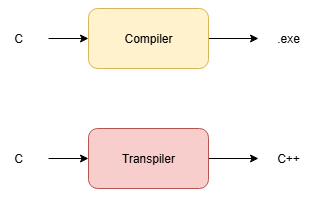

# Ditto

<p align="center">
  
  <br>
  <small><i>Image source: https://tenor.com/search/ditto-pokemon-gifs</i></small>
</p>

## Table of Contents

- [Ditto](#Ditto)
  - [Introduction](#introduction)
  - [Demo](#demo)
  - [Methodology](#methodology)
  - [File Structure](#file-structure)
  - [Getting started](#Getting-Started)
      - [Data](#data)
      - [Pretrained Models](#pretrained-models)
  - [References](#references)

## Introduction

Transpilers are system that convert code from one programming language to another. Ditto is a transpiler that converts code between C++ and C languages. The name comes from the Pokémon Ditto, which can copy any other Pokémon exactly. Our goal is to build an AI transpiler that can translate code across different programming paradigms, no matter the language. 

<p align="center">
  
</p>


For our project, we focus on C++ to C conversion and vice versa. Through this project, we aim to explore 2 hypotheses:

1) Can we build an AI system that is able to transpile code across programming paradigms? (For example, C → C++ and vice versa)

2) Can we integrate compiler domain knowledge to improve the performance of deep learning models? 

Specifically, we try to use the Abstract Syntax Tree given by parser to define the distance between any two tokens, and use that distance for calculating positional embeddings? We believe that by adding more domain knowledge to the model, we can reduce its dependence on data and see some improvements such as faster convergence, better performance etc.

<p align="center">
  
  <br>
  <small><i>Image source: https://ruslanspivak.com/lsbasi-part7/</i></small>
</p>

Consider the example expression `2*7+3`. If we look at this expression as a string, the distance between 7 and 3 is 1 token. However, from the AST perspective, they are 2 token apart from each other. Our hypothesis is that AST can be used as positional embedding and it will be a better representative of distances than normal techniques.


## Demo

## Methodology

The methodology comprises of 3 major sections: Data Collection, Preprocessing, and Model Architecture. For detailed information on each stage, please refer to the `README.md` files in the respective directory.

## Getting Started

### Installations

Preprocessor requires installing clang, libclang (for lexer) and tree-sitter (for parser)

#### Installation for clang and libclang

Make sure that all the requirements in `requirements.txt` are installed

`sudo apt-get install clang`

`sudo apt-get install libclang-dev`

`sudo apt install libclang-dev python3-clang`

You will also need to change the path in `set_library_file()` in `tokenization.py` to point to `libclang.co`. The below command will return the path to `libclang.co`

`find /usr/lib -name "libclang.so*" 2>/dev/null`

For example, `/usr/lib/llvm-18/lib/libclang.so`

### Data

Link to the final data can be found <a href="https://iiithydresearch-my.sharepoint.com/:f:/g/personal/prit_kanadiya_research_iiit_ac_in/IgAR9lw8HyPETLpzUu7I1G_jAUhxaU9ng8d3bSwhgZ_NzbI?e=HIzkt0">here</a>. This contains line number, transformed tokens, all obfuscation dictionaries and LCA distance vector in triu form. The size of both files combined is ~26GBs.

For training the model, we do not require obfuscation dictionaries. We only require transformed tokens and LCA distance vector. Link to the data useful for training can be found <a href="https://iiithydresearch-my.sharepoint.com/:f:/g/personal/prit_kanadiya_research_iiit_ac_in/IgAUZu2iso0HRqS21t70pEfnAdmpkvT8_uOQZ8vClWAwDb0?e=Vd6puv">here</a>. Please note that this data is in parquet format with combined size of ~1GB.

**Note:** The dataset provided above has been obtained after several preprocessing steps. To access the raw data files, intermediate output files, or logs, click <a href="https://iiithydresearch-my.sharepoint.com/:f:/g/personal/prit_kanadiya_research_iiit_ac_in/IgDP3mtf5hr1RIuOD9ePrzljAZbwoiaikGDwoTUWWTzUiDE?e=EWenOJ">here</a>.

### Model

## References

```
@misc{lachaux2020unsupervisedtranslationprogramminglanguages,
      title={Unsupervised Translation of Programming Languages}, 
      author={Marie-Anne Lachaux and Baptiste Roziere and Lowik Chanussot and Guillaume Lample},
      year={2020},
      eprint={2006.03511},
      archivePrefix={arXiv},
      primaryClass={cs.CL},
      url={https://arxiv.org/abs/2006.03511}, 
}

@misc{nachmani2024translatotron3speechspeech,
      title={Translatotron 3: Speech to Speech Translation with Monolingual Data}, 
      author={Eliya Nachmani and Alon Levkovitch and Yifan Ding and Chulayuth Asawaroengchai and Heiga Zen and Michelle Tadmor Ramanovich},
      year={2024},
      eprint={2305.17547},
      archivePrefix={arXiv},
      primaryClass={cs.CL},
      url={https://arxiv.org/abs/2305.17547}, 
}
```