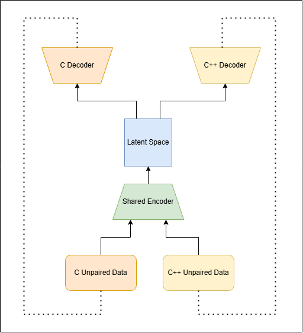
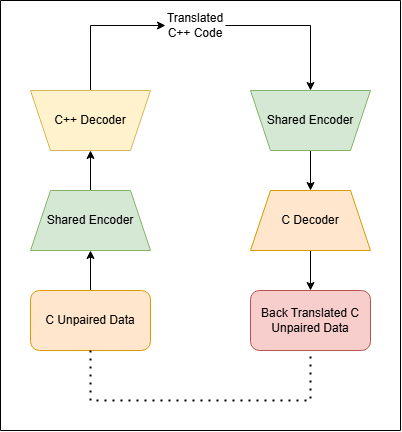

# Model

## Introduction

The model architecture is inspired from Transcoder and Translatotron 3. We use a shared encoder for both C and C++, and separate decoders for both languages.

The model is divided into two phases. The aim of first phase it to learn the shared encoder, and both decoders. The second phase of the model involves learning mapping between C and C++ using back translation.

We use both phases to ensure that our model can learn converting C++ to C and vice versa without using any paired data. The below diagrams represent the model phases.

  
   
  <small><i>Phase 1</i></small>

  
   
  <small><i>Phase 2</i></small>

